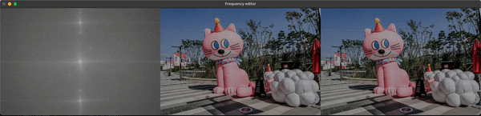
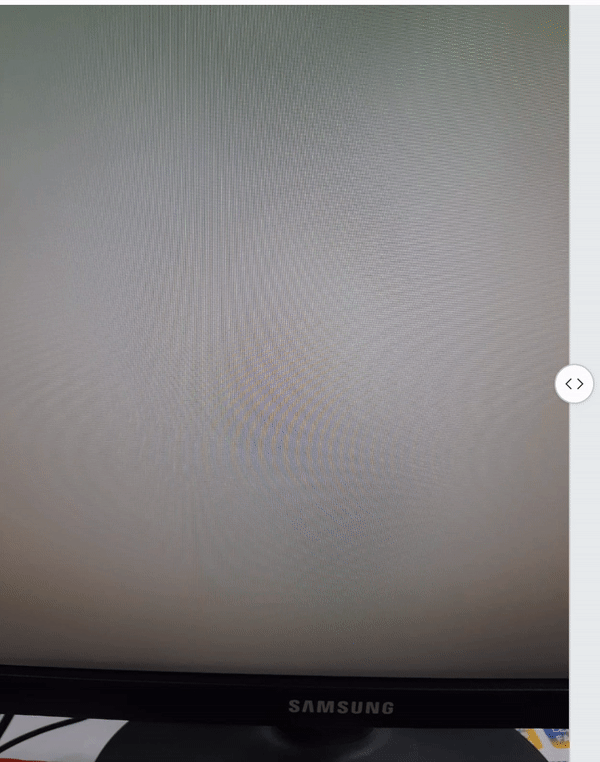

# Editing a moire image in the frequency domain.
Moire is a high frequency pattern that overlays image content due to overlay between the camera sensor pattern and other high frequency repetitive patterns.
While many image editing softwares exist for increasing brightness, contrast, highlights, shadows, etc., current moire removal is only done as a black-
box enhancement with no user control. In this project, we tried to create a simple image editor which a user can interact with and remove any unwanted moir ́e patterns while keeping the sharper details in the image. 

## Installation:
Required packages can be installed through a conda environment using the requirements.txt and the below command:

```conda create --name <env> --file requirements.txt```

## Editor:

-  The editor takes in an image and displays the frequency spectrum, output after the current edit, and the original input image for comparison side-by-side.
- Users can filter out high power peaks in the frequency spectrum by drawing band-pass filters dragging the mouse (left button) across a desired area in the power spectrum.
- After a filter has been drawn, the output from the filtered power is updated in the middle which can be compared with the input on the right.

## Usage:
``` python3 moire.py --input <input_file_name>```

## Results:


Please see the project report for more comparisons.